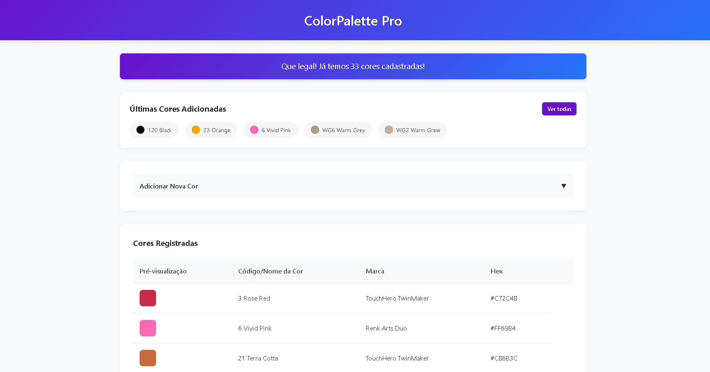

# My ColorPalette Pro


Um aplicativo web para gerenciamento profissional de paletas de cores, com ordenação inteligente e visualização imediata.

🔗 **Demo**: [https://harrisalexandre.github.io/My-ColorPalette-Pro/)



## ✨ Funcionalidades

- 🎨 Visualização imediata das cores com prévia
- 🔢 Ordenação automática (numérica para cores com números, alfabética para siglas)
- 📱 Design responsivo que funciona em desktop e mobile
- ⚡ Sistema de ações por hover/toque (sem coluna fixa)
- 📅 Seção de cores recentemente adicionadas
- 📊 Contador automático de cores cadastradas
- ✏️ Formulário recolhível para economia de espaço

## 🛠️ Tecnologias

- **Frontend**:
  - 
  - 
  - 

## 🚀 Como Usar

### Pré-requisitos

- Navegador moderno (Chrome, Firefox, Edge, Safari)

### Instalação Local

1. Clone o repositório:
   ```bash
   git clone https://github.com/seu-usuario/colorpalette-pro.git
   ```
2. Navegue até o diretório:
   ```bash
   cd colorpalette-pro
   ```
3. Abra o arquivo `index.html` no seu navegador

## 🌐 GitHub Pages

O app está configurado para deploy automático no GitHub Pages:

1. Acesse `Settings` > `Pages` no seu repositório
2. Selecione o branch `main` como fonte
3. Seu app estará disponível em:
   ```
   https://seu-usuario.github.io/colorpalette-pro/
   ```

## 🏗️ Estrutura do Projeto

```
colorpalette-pro/
├── index.html          # Página principal
├── css/
│   └── styles.css      # Estilos principais
├── js/
│   ├── script.js       # Lógica da aplicação
│   └── colors-db.js    # Banco de dados de cores
├── screenshot.png      # Captura de tela para o README
└── README.md           # Este arquivo
```

## 🤝 Como Contribuir

Contribuições são bem-vindas! Siga estes passos:

1. Faça um fork do projeto
2. Crie sua branch (`git checkout -b feature/nova-feature`)
3. Commit suas mudanças (`git commit -m 'Adiciona nova feature'`)
4. Push para a branch (`git push origin feature/nova-feature`)
5. Abra um Pull Request

## 📄 Licença

Este projeto está licenciado sob a licença MIT - veja o arquivo [LICENSE](LICENSE) para detalhes.

---

Feito por [Harris Alexandre](https://www.instagram.com/_harrisalexandre/).
